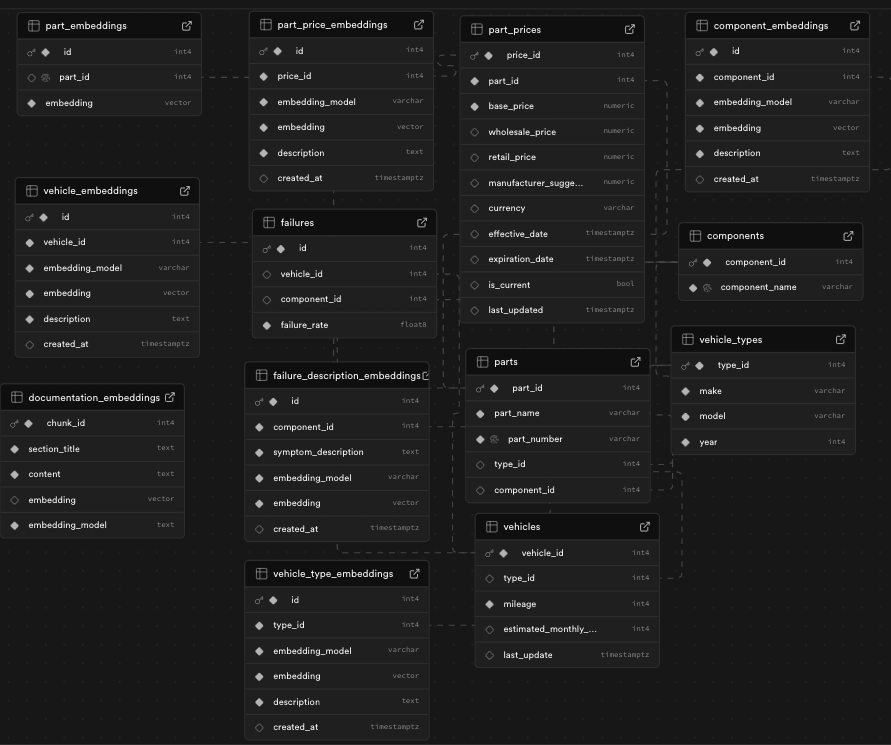

## Vehicast (automotive‑algo)

### Technical Overview

This proof of concept is a system that:
- Predicts component failures for specific vehicles at specific mileages
- Analyzes local vehicle registrations to understand what vehicles exist in a given area
- Forecasts demand based on vehicle types and historical failure rates
- Optimizes inventory levels for distributors to meet local demand efficiently
- Provides quick part identification for mechanics doing specific repairs

- Distributors who have parts in stock win sales, even at higher prices
- Mechanics prioritize fast turnaround and will pay more to get parts same-day
- Reduced downtime for drivers leads to happier customers
- Local auto shops can compete with major chains through better inventory management

### Synthetic Data

For this proof of concept, I generated synthetic datasets to power the predictive modeling.

I simulated vehicle registration data across different geographic regions, created component failure histories based on vehicle make/model/year combinations, and established parts fitment relationships to connect vehicles with the correct components.

This synthetic data foundation demonstrates how real-world vehicle and parts data would flow through the system to generate actionable inventory recommendations for distributors.

### Predictive Modeling

The predictive modeling system consists of two main components: a training pipeline and a prediction service.

#### Training Pipeline
- Uses scikit-learn’s LogisticRegression with balanced class weights to account for the rarity of failure events
- Creates separate models for each component type (brakes, alternators, etc.)
- Processes vehicle data using OneHotEncoder for categorical features (make, model) and standardizes numerical features (year, mileage)
- Implements a train-test split (80/20) to validate model performance
- Calculates standard metrics (accuracy, precision, recall, F1) to assess prediction quality
- Saves trained models using pickle serialization

#### Prediction Service
- Loads the component-specific models from storage
- Takes vehicle information (make, model, year, mileage) as input
- Calculates failure probabilities for each component
- Uses a configurable threshold (default 0.1) to identify likely failures
- Maps components to specific replacement parts through database queries

This connects predictive analytics to inventory management by identifying which parts are likely to be needed based on the local vehicle population, helping distributors stock the right parts at the right time.

### Database Architecture

The system is built on a Supabase PostgreSQL database with a carefully designed schema optimized for automotive parts management and predictive analytics.

#### Vector Embeddings
Embeddings power:
- Part similarity detection to find suitable alternatives when exact matches aren’t available
- Vehicle similarity for extending predictions to similar makes/models
- Component failure pattern recognition across vehicle types

#### Relational Structure
The database maintains critical relationships between:
- Vehicles and their compatible parts
- Components and their associated failure rates
- Parts and their pricing information
- Vehicle types and their registration statistics

Supabase Database Schema: specialized tables for parts, part prices, vehicles, components, failures, and various embedding tables that store vector representations for semantic operations.

This architecture enables efficient querying of complex relationships while supporting the vector operations needed for advanced predictive analytics.

### Frontend Implementation

Two specialized dashboards tailored to different user roles:

#### Distributor Dashboard
- Interactive heatmap visualization showing geographic demand concentration
- Time-window adjustable forecasts for inventory planning (7 days to 6 months)
- Top components by forecasted demand with dynamic scaling
- Inventory valuation metrics with shortage/excess indicators
- Automated reorder recommendations based on predicted demand

#### Mechanic Dashboard
- Semantic search for finding parts by description, not just part numbers
- Vehicle-specific part compatibility filtering
- Interactive 3D component visualization for complex assemblies
- Intelligent part alternatives suggestions when exact matches are unavailable
- Streamlined cart and checkout with real-time availability

Both interfaces leverage the vector embeddings in the database to provide intelligent recommendations.

